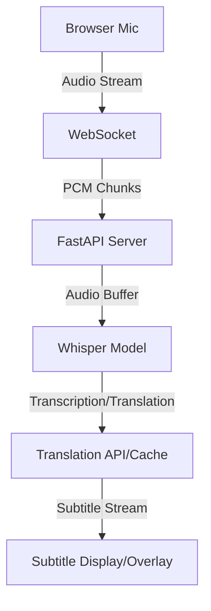

# 🎤 LiveTranslateSubs — High-Performance Live Speech Translation


## 🌟 Overview
**LiveTranslateSubs** is a sophisticated, real-time speech translation system that captures live microphone audio from the browser, translates it into English, and displays it with ultra-low latency. It leverages the power of `faster-whisper` for high-performance inference and `FastAPI` for a modern, asynchronous backend.

## 🏗️ Architecture


## 🚀 Features
- 🏎️ **FastAPI & Asyncio Backend**: Fully asynchronous architecture for high concurrency and lower latency.
- 🌊 **True Word-Level Streaming**: Captions appear word-by-word as you speak.
- 🧠 **Dynamic Model & GPU Control**: Switch between `Tiny` to `Large-v3` models and CPU/GPU hardware on the fly.
- 🗣️ **Manual Language Lock**: Precision language selection to prevent auto-detection errors.
- ⏱️ **Subtitle Timestamping**: Real-time start/end timestamps for every word/segment.
- 💾 **Subtitle Export**: Save sessions as professional `.srt` or `.vtt` files with accurate timing.
- ⚡ **Translation Caching**: Optimized repeats handling to reduce processing load.
- 🎥 **OBS Overlay Mode**: Dedicated transparent view for live streamers.
- 🐳 **Docker Support**: Easy deployment using containerization.

## ⚙️ Installation & Setup

### Local Installation
1. **Clone the Repository**
   ```bash
   git clone https://github.com/your-username/LiveTranslateSubs.git
   cd LiveTranslateSubs
   ```
2. **Install Dependencies**
   ```bash
   pip install -r requirements.txt
   ```
3. **Run the Application**
   ```bash
   python app.py
   ```

### Docker Deployment
1. **Build the Image**
   ```bash
   docker build -t livetranslate .
   ```
2. **Run the Container**
   ```bash
   docker run -p 5000:5000 livetranslate
   ```

## 📺 Demo
Access the main interface at: `http://127.0.0.1:5000`
Access the OBS Overlay at: `http://127.0.0.1:5000/overlay`

## 🛠 Future Improvements
- [ ] Multiple output languages support.
- [ ] UI themes and customizable subtitle styles.
- [ ] Integration with more LLMs for post-translation refinement.
- [ ] Native desktop application wrapper.

---

## 👤 Author
**Ranjan Thakur**
Engineering Student | GenAI & Real-Time Systems Enthusiast
