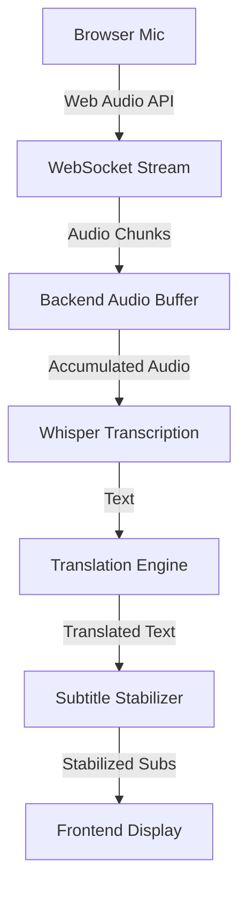

# LiveTranslateSubs 🎙️🌍

LiveTranslateSubs is a professional-grade, real-time speech translation system designed for low-latency subtitle generation. It features an adaptive AI engine that automatically scales its performance based on available hardware, ensuring smooth operation on everything from low-end CPUs to high-performance CUDA GPUs.

## 🚀 Key Features

- **Adaptive AI Engine**: Automatically detects system RAM and GPU to select the best Whisper model (`tiny`, `base`, or `small`/`medium`).
- **Real-Time Streaming**: Low-latency audio streaming from the browser using Web Audio API and WebSockets.
- **Speech-to-Text Translation**: High-accuracy transcription via `faster-whisper` followed by specialized text translation.
- **Subtitle Stabilization**: Advanced buffering and stabilization logic to reduce flickering and hallucinations.
- **Hardware Agnostic**: Fully compatible with 4GB RAM CPU-only systems while leveraging NVIDIA GPUs when available.

## 🏗️ System Architecture



## ⚙️ Hardware Adaptive Logic

| System Tier | Hardware Specs | Model Selected | Device |
|-------------|----------------|----------------|--------|
| **Low-End** | <= 4GB RAM, No GPU | `tiny` | CPU |
| **Mid-Range** | 8GB+ RAM, No GPU | `base` | CPU |
| **High-End** | NVIDIA GPU Detected | `small` / `medium` | CUDA |

## 🛠️ Installation & Setup

1. **Clone the repository**:
   ```bash
   git clone https://github.com/avy2025/LiveTranslateSubs.git
   cd LiveTranslateSubs
   ```

2. **Install Dependencies**:
   ```bash
   pip install -r requirements.txt
   ```

3. **Run the Application**:
   ```bash
   python main.py
   ```
   *Note: I will create a entry points main.py that calls backend/server.py*

4. **Access UI**:
   Open `http://127.0.0.1:5000` in your browser.

## 🐳 Docker Deployment

Build and run using Docker:
```bash
docker build -t live-translate-subs .
docker run -p 5000:5000 live-translate-subs
```

---
Developed as a high-performance modular system for real-time live translation.
